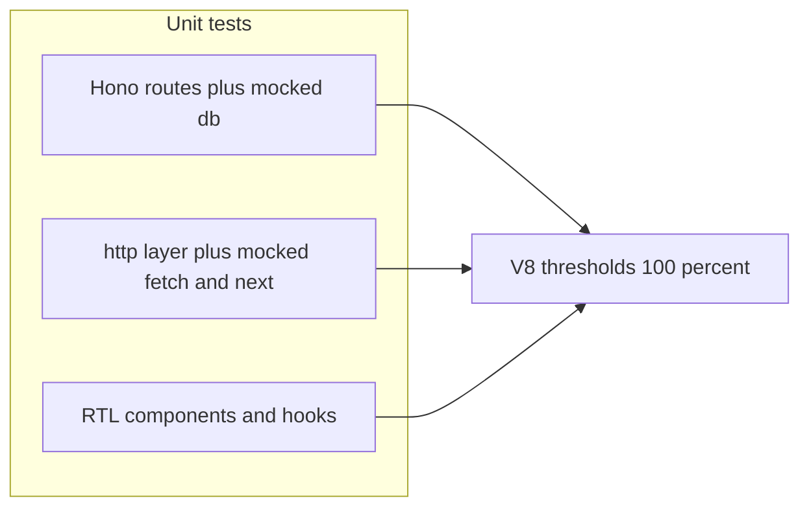

# Unit testing plan: 100% coverage (`src/`)

## Scope (confirmed)

- **In scope for coverage thresholds:** all [`src/**/*.ts`](src) and [`src/**/*.tsx`](src) **except** [`src/api/db/seed.ts`](src/api/db/seed.ts) (CLI-style script; optional to add a separate integration test later).
- **Out of scope:** root [`next.config.ts`](next.config.ts), [`drizzle.config.ts`](drizzle.config.ts), and other non-`src/` files (no coverage gates).

## Package manager (pnpm)

This repository uses **pnpm** (`pnpm-lock.yaml`). For all dependency and script commands, use **pnpm only** — not npm or yarn.

- Install dependencies: `pnpm install`
- Add dev dependencies (e.g. Vitest): `pnpm add -D <package>`
- Run scripts from [`package.json`](package.json): `pnpm test`, `pnpm run test:run`, `pnpm run test:coverage`
- One-off binaries: `pnpm exec vitest` or `pnpm dlx <pkg>` instead of `npx`

## Tooling

| Piece | Choice | Role |
|--------|--------|------|
| Runner | **Vitest** (v3) | Fast TS-native runner, good ESM + monorepo-style config |
| Coverage | **`@vitest/coverage-v8`** | Istanbul-compatible reports; enforce `lines`, `functions`, `branches`, `statements` at **100%** on the include glob |
| DOM / React | **`@testing-library/react`** + **`@testing-library/user-event`** | Components and hooks |
| Environment | **`jsdom`** (or `happy-dom`) | Client components; use **`node`** for API-only tests |

Add scripts in [`package.json`](package.json): `test` (watch), `test:run` (CI), `test:coverage` (run + report). Run them with **pnpm** (e.g. `pnpm test`, `pnpm run test:coverage`).

Add [`vitest.config.ts`](vitest.config.ts) at the repo root with:

- `test.match`: `**/*.{test,spec}.{ts,tsx}` under `src/`
- `coverage.provider`: `v8`
- `coverage.include`: `src/**/*.{ts,tsx}`
- `coverage.exclude`: `src/api/db/seed.ts`, plus Vitest defaults (`**/*.d.ts`, etc.)
- `coverage.thresholds`: all metrics **100** on the included set (adjust only if you later add a justified exclusion)
- **`coverage.all: true`** so untouched files fail the gate

Optional: split **two Vitest projects** (same config file) — `node` for API/Hono/http mocks and `jsdom` for UI — to avoid leaking `window` into server tests.

## Cross-cutting test setup

Create something like [`src/test/setup.ts`](src/test/setup.ts) (path is conventional; keep it out of `coverage.include` or name it `setup.vitest.ts` and exclude it) that:

1. **Stable env for env modules** — [`src/api-env.ts`](src/api-env.ts) and [`src/client-env.ts`](src/client-env.ts) run `zod` parse at import time. Set `process.env` (and `vi.stubEnv`) *before* importing modules under test, or use `vi.resetModules()` + dynamic `import()` in tests that need different env shapes.
2. **Next.js server APIs** — mock [`next/cache`](src/http/list-issues.ts) (`cacheLife`, `cacheTag`, `updateTag`), [`next/headers`](src/http/create-comment.ts) (`headers`), and ensure [`server-only`](src/http/create-comment.ts) does not block Vitest (often a no-op stub in tests).
3. **Global `fetch`** — `vi.stubGlobal('fetch', vi.fn())` with per-test implementations for [`src/http/*`](src/http) (JSON payloads matching Zod schemas from [`src/api/routes`](src/api/routes)).
4. **Better Auth / Hono session** — for [`src/api/index.ts`](src/api/index.ts) and routes, mock `auth.api.getSession` to return `{ user, session } | null` so middleware and `requireAuth` paths are reachable without a real OAuth flow.

## Layer-by-layer strategy

### 1. Hono API ([`src/api`](src/api))

- **Approach:** Import the **route modules** (e.g. [`listIssues`](src/api/routes/list-issues.ts)) mounted on a small `OpenAPIHono` test app, or import the default [`app`](src/api/index.ts) and call `app.request(new Request('http://localhost/api/issues?...'))`.
- **Mock** [`src/api/db/index.ts`](src/api/db/index.ts) (`vi.mock('@/api/db')`) with an in-memory object or **`vi.fn()`** return values per test so Drizzle chains (`select`, `where`, `orderBy`, `$count`) are exercised without PostgreSQL.
- **Cover:** success JSON, validation errors (query/body), **401** from [`requireAuth`](src/api/middlewares/auth.ts) where used, and the **defaultHook** validation path in [`src/api/index.ts`](src/api/index.ts) (send invalid body/query).
- **Auth wiring:** mock [`src/api/auth.ts`](src/api/auth.ts) minimally or mock `getSession` only so [`src/api/index.ts`](src/api/index.ts) session middleware runs.

### 2. Schemas and shared API pieces

- [`src/api/routes/schemas/*`](src/api/routes/schemas) — table-driven tests: valid/invalid parses where branches exist (e.g. [`errors.ts`](src/api/routes/schemas/errors.ts)).

### 3. DB module ([`src/api/db/index.ts`](src/api/db/index.ts))

- One dedicated test file: mock `postgres` and `@/api-env`, then import `db` and assert the drizzle factory was called (or export is defined). Ensures constructor lines execute under coverage.

### 4. HTTP / server data layer ([`src/http`](src/http))

- Mock **`fetch`** to return `Response.json(...)` with payloads that pass/fail Zod parsing.
- For [`create-comment.ts`](src/http/create-comment.ts): mock `headers()` to return a `Headers` with cookies; assert `updateTag` is called with the expected tag.
- Files with **`"use cache"`** ([`list-issues.ts`](src/http/list-issues.ts), [`get-issue.ts`](src/http/get-issue.ts), [`list-issue-comments.ts`](src/http/list-issue-comments.ts)): mocked `next/cache` should be no-ops so the async body still runs.

### 5. Utilities

- [`src/http/utils/get-cookies-from-headers.ts`](src/http/utils/get-cookies-from-headers.ts) — pure unit tests with constructed `Headers`.

### 6. Client hooks and providers

- [`src/hook/useLikeMutation.ts`](src/hook/useLikeMutation.ts) — wrap in `QueryClientProvider`, mock [`toggleLike`](src/http/toggle-like.ts), assert optimistic updates, rollback on error, and `invalidateQueries` predicate behavior (including `issueId` and comma-separated keys).
- [`src/lib/react-query.tsx`](src/lib/react-query.tsx) — smoke render with children.
- [`src/lib/auth-client.ts`](src/lib/auth-client.ts) — read file and test any exported helpers; mock `better-auth` client if needed.

### 7. UI components ([`src/components`](src/components))

- For each component: render with RTL, user events on interactive elements, assert ARIA and critical DOM (e.g. [`like-button.tsx`](src/components/like-button.tsx) disabled state while pending).
- [`src/components/styles.ts`](src/components/styles.ts) — if it only exports class strings, assert outputs for representative inputs.

### 8. App Router ([`src/app`](src/app))

- **Server components / pages:** treat default exports as **async functions**: `await Page({ params: Promise.resolve({ id: '...' }), searchParams: Promise.resolve({}) })` with **`vi.mock`** on `@/http/*` to return deterministic data. Assert returned React elements (e.g. key props, column titles) via snapshot or shallow checks.
- **Layouts** — render with React DOM server or RTL where they are client-safe; for layouts that only compose providers, one test per layout verifying structure.
- **[`src/app/api/[[...route]]/route.ts`](src/app/api/[[...route]]/route.ts)** — either export a tiny wrapper under test or assert `GET`/`POST`/`PATCH`/`DELETE`/`PUT` are the Hono `handle` bindings (import + spy) so lines execute.
- **[OpenGraph](src/app/issues/[id]/opengraph-image.tsx)** — mock `@/http/get-issue` and **`next/og`** `ImageResponse` if needed (return a stub with a marker) so the JSX branch runs without full OG rendering.

## Order of implementation (recommended)

1. Tooling + global setup + env/fetch mocks.
2. Pure modules and schemas (quick wins).
3. Hono routes + mocked DB (largest API surface).
4. `src/http` with Next mocks.
5. Hooks and components.
6. `src/app` pages/layouts/loadings/skeletons (often many small files; batch by feature: board, issues, drawer).
7. Raise thresholds to 100% and fix remaining gaps (branches often need extra cases).

## Deliverable: [PLAN.md](PLAN.md)

After you approve this plan, add **[PLAN.md](PLAN.md)** at the repository root containing: scope, **pnpm** package-manager rules, tooling table, setup notes, layer strategies, implementation order, and how to run `pnpm test:coverage`. This keeps the repo self-documenting without relying only on Cursor plan storage.

## Risks and mitigations

| Risk | Mitigation |
|------|------------|
| `"use cache"` / RSC directives confuse the runner | Mock `next/cache`; keep server tests in `node` project |
| `api-env` throws on import | Centralize `vi.stubEnv` in `beforeEach` + `vi.resetModules()` |
| Flaky timers in React Query | `vi.useFakeTimers()` only where needed; await `waitFor` |
| 100% **branches** on large pages | Add focused tests for each `if`/ternary; extract tiny helpers only if a branch is untestable |

## CI (optional follow-up)

Add a job that runs `pnpm exec vitest run --coverage` (or `pnpm run test:coverage` if defined) and uploads the `coverage/` artifact; fail the job if thresholds slip.
